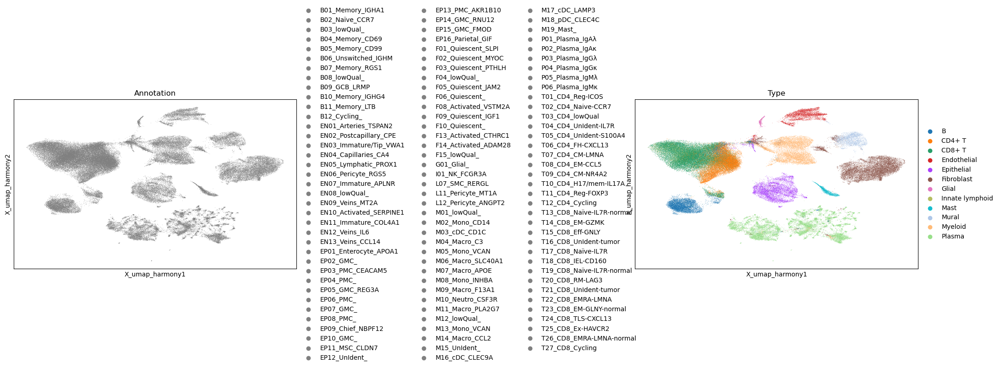
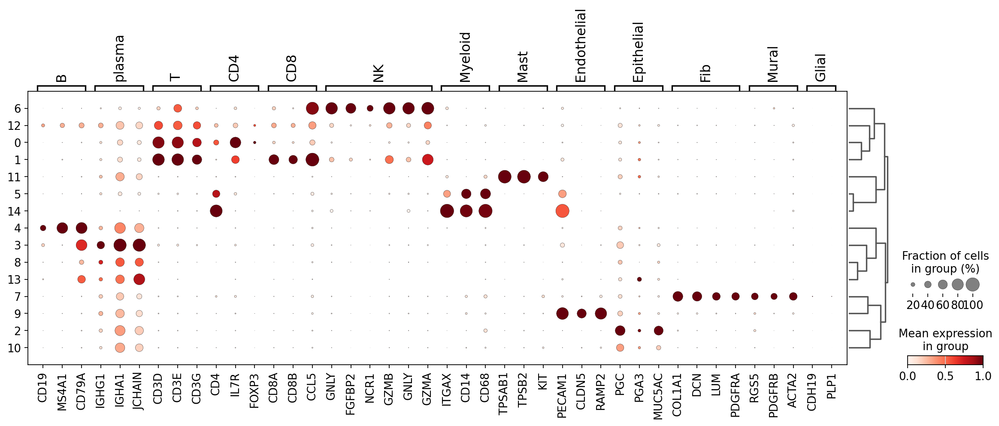
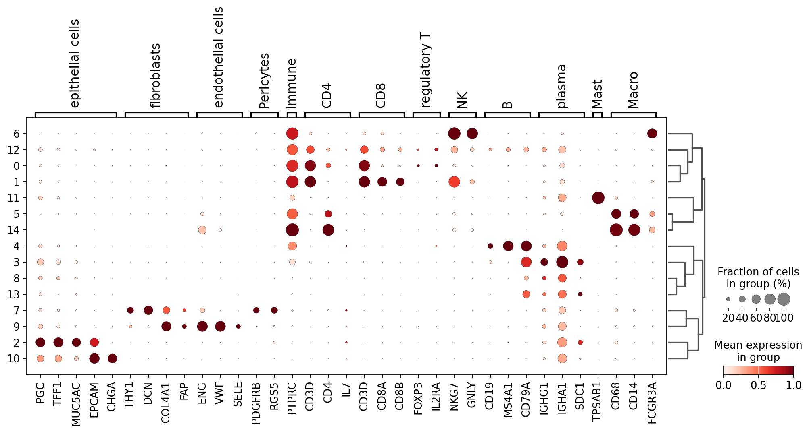
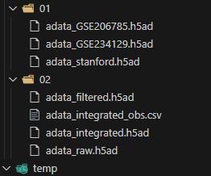

# Target

- Build a large single cell gastric atlas  
  - to capture the variability present, such as tumor location, tissue type, in the population with bulk, single cell and omics.
  - to find undiscovered cell types.
  - Investigate the heterogeneity, define new modules 
  - to provide a large dataset for algorithm development.
- Add more information in the future
  - spatial data
  - multiomics in bulk and single cell


If you have interests in mining the large dataset and share your code to accelerate and facilitate the reproducible work. Please fell free to contact with me: mugpeng@foxmail.com 


# Ref

Several aspects can be achieved.


The basic pipeline of this article ref from:

- [Evolution of immune and stromal cell states and ecotypes during gastric adenocarcinoma progression - PubMed (nih.gov)](https://pubmed.ncbi.nlm.nih.gov/37419119/)
- [Single-Cell Atlas of Lineage States, Tumor Microenvironment, and Subtype-Specific Expression Programs in Gastric Cancer - PubMed (nih.gov)](https://pubmed.ncbi.nlm.nih.gov/34642171/)


The atlas level article:

- [An integrated cell atlas of the lung in health and disease | Nature Medicine](https://www.nature.com/articles/s41591-023-02327-2)
- [Automatic cell-type harmonization and integration across Human Cell Atlas datasets: Cell](https://www.cell.com/cell/fulltext/S0092-8674(23)01312-0)
- [Liver tumour immune microenvironment subtypes and neutrophil heterogeneity | Nature](https://www.nature.com/articles/s41586-022-05400-x)
- [Integrated multi-omics profiling to dissect the spatiotemporal evolution of metastatic hepatocellular carcinoma: Cancer Cell](https://www.cell.com/cancer-cell/abstract/S1535-6108(23)00401-4)


Cell interaction:

- [Interactions between MFAP5 + fibroblasts and tumor-infiltrating myeloid cells shape the malignant microenvironment of colorectal cancer | Journal of Translational Medicine | Full Text (biomedcentral.com)](https://translational-medicine.biomedcentral.com/articles/10.1186/s12967-023-04281-6#Sec13)
- [Single-cell and spatial analysis reveal interaction of FAP+ fibroblasts and SPP1+ macrophages in colorectal cancer | Nature Communications](https://www.nature.com/articles/s41467-022-29366-6)
- [Identification of a tumour immune barrier in the HCC microenvironment that determines the efficacy of immunotherapy - PubMed (nih.gov)](https://pubmed.ncbi.nlm.nih.gov/36708811/)


sub celltype identification and propose novel prognostic signature:

- [Integrated analysis of single-cell and bulk transcriptomics develops a robust neuroendocrine cell-intrinsic signature to predict prostate cancer progression - PubMed (nih.gov)](https://pubmed.ncbi.nlm.nih.gov/38250042/)
- [Integrated Analysis Highlights the Immunosuppressive Role of TREM2+ Macrophages in Hepatocellular Carcinoma - PubMed (nih.gov)](https://pubmed.ncbi.nlm.nih.gov/35359989/)
- [Single-Cell Transcriptomic Analysis Reveals the Crosstalk Propensity Between the Tumor Intermediate State and the CD8+ T Exhausted State to be Associated with Clinical Benefits in Melanoma - PubMed (nih.gov)](https://pubmed.ncbi.nlm.nih.gov/35903095/)
- [High-resolution single-cell atlas reveals diversity and plasticity of tissue-resident neutrophils in non-small cell lung cancer - PubMed (nih.gov)](https://pubmed.ncbi.nlm.nih.gov/36368318/)


Microenvironment difference in different clinical group:

- [A single-cell atlas of the multicellular ecosystem of primary and metastatic hepatocellular carcinoma | Nature Communications](https://www.nature.com/articles/s41467-022-32283-3)
- [Epstein-Barr virus DNA seropositivity links distinct tumoral heterogeneity and immune landscape in nasopharyngeal carcinoma - PubMed (nih.gov)](https://pubmed.ncbi.nlm.nih.gov/36860875/)


Benchmark test:

- [Automatic cell type identification methods for single-cell RNA sequencing - ScienceDirect](https://www.sciencedirect.com/science/article/pii/S2001037021004499)
- [A comparison of automatic cell identification methods for single-cell RNA sequencing data | Genome Biology | Full Text (biomedcentral.com)](https://genomebiology.biomedcentral.com/articles/10.1186/s13059-019-1795-z)
- [Benchmarking atlas-level data integration in single-cell genomics | Nature Methods](https://www.nature.com/articles/s41592-021-01336-8)
- [Comparison of methods and resources for cell-cell communication inference from single-cell RNA-Seq data | Nature Communications](https://www.nature.com/articles/s41467-022-30755-0#Sec2)


Database website for multiomics with bulk and single cell:

- [DISCO: a database of Deeply Integrated human Single-Cell Omics data - PubMed (nih.gov)](https://pubmed.ncbi.nlm.nih.gov/34791375/)


Learn single cell:

Because It's more efficient to run Python to process the large scale single cell data, I would recommend you to use Scanpy rather than Seurat.

-  [Single-cell best practices — Single-cell best practices (sc-best-practices.org)](https://www.sc-best-practices.org/preamble.html)
- [API — Scanpy 0.1.0.dev documentation](https://scanpy.readthedocs.io/en/stable/api.html)
- [Seurat - Guided Clustering Tutorial • Seurat (satijalab.org)](https://satijalab.org/seurat/articles/pbmc3k_tutorial.html)


## Little advice for novice

Use data: [GEO Accession viewer (nih.gov)](https://ncbi.nlm.nih.gov/geo/query/acc.cgi?acc=GSE206785) From [Parallel single-cell and bulk transcriptome analyses reveal key features of the gastric tumor microenvironment - PubMed (nih.gov)](https://pubmed.ncbi.nlm.nih.gov/36550535/) with annotated 111,140 cells



And imitate [Integrated Analysis Highlights the Immunosuppressive Role of TREM2+ Macrophages in Hepatocellular Carcinoma - PubMed (nih.gov)](https://pubmed.ncbi.nlm.nih.gov/35359989/) try to warm you up.


# Data Info

The details of datasets and sample info can be accessed in  `Article/Dataset` and `Article/Sample` files.


10 dataset with raw fq:

- Cells:
  - unfiltered: 1,092,591 
  - filtered: 834,360
- Samples:
  - 125 ( primary cancers, adjacent lesion) 
  - 17 pbmc
  - 9 precancer
  - 4 health donor
  - 2 tumor infiltrated lymphocyte   






116 samples with processed mtx including:

- 116 ( primary cancers + adjacent lesion)
- 10 metastasis
- 4 pbmc
- 1 precancer 


## Single cell obj

I have rerun the 10x cellranger 7.1 using Ensembl84 to reproduced the raw mtx for the samples with raw fq data(totally 11 datasets). Besides, six projects provide processed mtx or obj. The details are described in `Article/Dataset` and `Article/Sample` files.

I have conducted the basic filter and integration job to got the basic annotation result, totally 834,360 cells after filter. 

 


- 02/raw: merged without filter
- 02/filtered: filtered without integrated
- 02/integrated: integrated and annotated 


You can contact me to get the result.


# Code Info


## Envir Install

```
mamba create -n sc_py3 python=3.8 python-igraph leidenalg ipykernel -y
pip install 'scanpy>1.8.1'
mamba install -y r-base r-seurat
```


## file Structure

- 01-Ref_Preprocess.ipynb

Three datasets with processed data and annotation were collected. 

The performance of scale(center data with zero mean and 1 standard deviation) and unscale in bio conservation and batch correction is also examined.


- 02-Preprocessed.ipynb

filter cells through:

cell quality control: 1) gene counts < 6500, mRNA counts > 200, mitochondrial mRNA counts percentage < 15%; 2) gene counts and mRNA counts both in their 5 MAD (median absolute deviations) ranges; 3) remove doublets by Scrublet with default parameters. 4) We further filtered out samples with less than 500 cells remaining. Though excluded from the data integration, these samples are marked as low quality 

Using the first 50 principal components, a neighborhood graph was calculated with the number of neighbors set to k = 30. Batch was removed by `harmony`. Data were subsequently clustered with Louvain clustering at a resolution of r = 0.25.

Major celltypes are annotated by marker-based, reference-based and manual annotation.


## Outside package detail

- sceasy

[cellgeni/sceasy: A package to help convert different single-cell data formats to each other (github.com)](https://github.com/cellgeni/sceasy)

[JiekaiLab/scDIOR: scDIOR: Single cell data IO softwaRe (github.com)](https://github.com/JiekaiLab/scDIOR?tab=readme-ov-file)


## Bug

- scib_metrics

```
pip install scib_metrics
from scib_metrics.benchmark import Benchmarker

AttributeError: module 'jax.random' has no attribute 'KeyArray'
```

Ref: [theislab/scib: Benchmarking analysis of data integration tools (github.com)](https://github.com/theislab/scib)

```
pip install --upgrade jax jaxlib chex
# useless
pip install ml_dtypes==0.2.0 jax==0.4.13 jaxlib==0.4.11


```


- no graph in jupyter notebook output

```
%matplotlib inline
```


- unrar remain structure

```
nohup unrar x Raw.rar &
```


[command line - unrar nested folder in ubuntu strange behaviour - Ask Ubuntu](https://askubuntu.com/questions/1317795/unrar-nested-folder-in-ubuntu-strange-behaviour)


- For instance, if you have an object created from a class in a module and then you change the class definition in the module's source file, re-importing the module won't change the behavior or structure of the existing object. The object will continue to behave according to the class definition that was in place at the time it was created.

you should change the python file name to reload a module.


- TypeError: metaclass conflict: the metaclass of a derived class must be a (non-strict) subclass of the metaclasses of all its bases

[`TypeError: metaclass conflict`: matplotlib v3.7.0 is incompatible with scanpy · Issue #2411 · scverse/scanpy (github.com)](https://github.com/scverse/scanpy/issues/2411)

```
pip install 'matplotlib<3.7'
```


- [TypeError: _detect_vcs() missing 2 required positional arguments: 'expected_vcs' and 'path' · Issue #25 · YangLabHKUST/STitch3D (github.com)](https://github.com/YangLabHKUST/STitch3D/issues/25)

```
pip install scanpy>1.8.1 
```


- scanpy rank_genes_groups AttributeError: module 'numba' has no attribute 'core'

uninstall scanpy, then install through mamba:

```
mamba install conda-forge::scanpy -y
```

